#  Linear Regression Using Least Squares **LLS** 

# **abalone** 

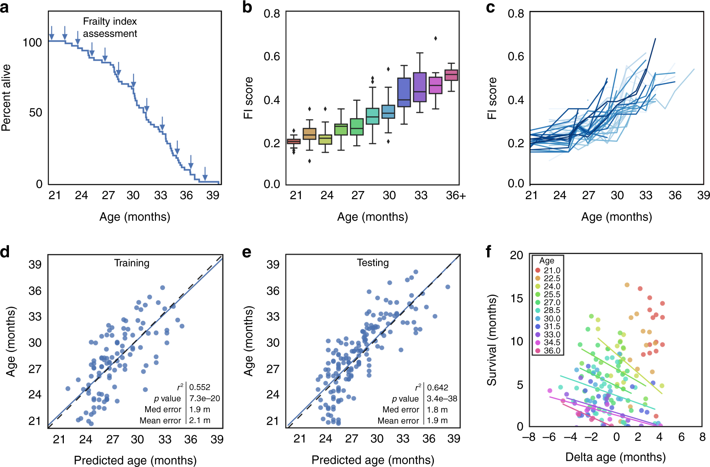

## In the csv file of the [abalone](https://www.kaggle.com/datasets/rodolfomendes/abalone-dataset), we are looking to predict its height by receiving the length of the abalone

## plot 

### Display the Pairs plot (pairwise plot) in seaborn 

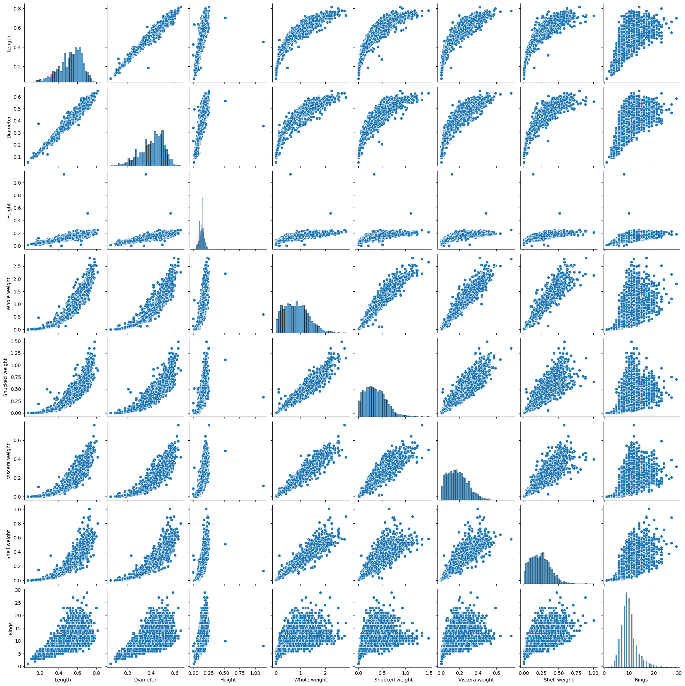

###  Display the confusion matrix diagram with matplotlib

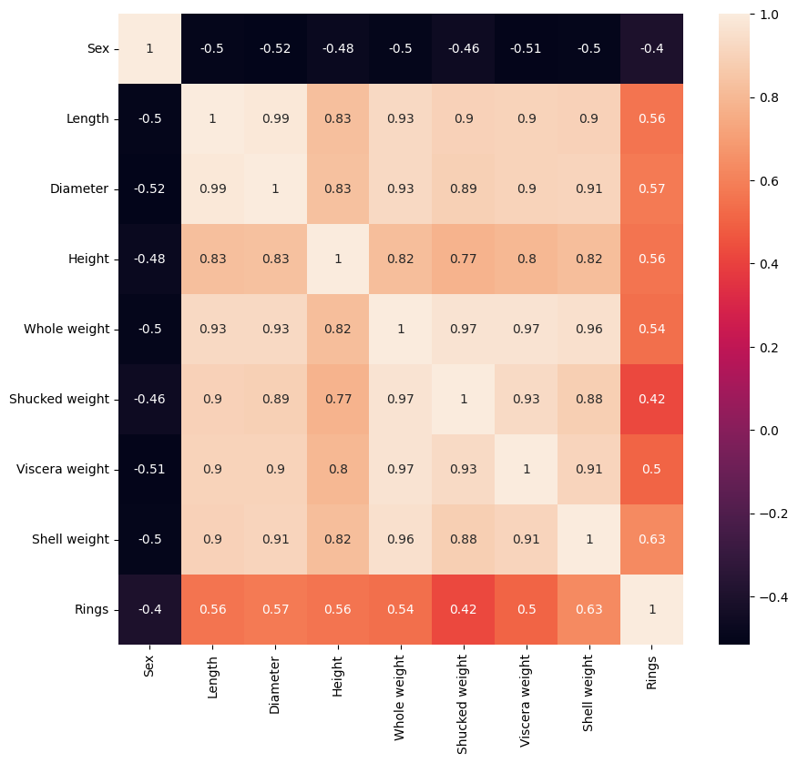

###  Display the slope of a line  with matplotlib

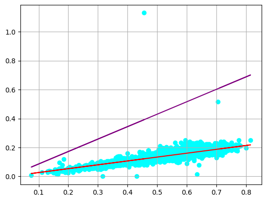

----

# **Students Performance (Regression)**

## Generate continuous random dataset for the problem of X = study hours and Y = grade of students (if you study more, you will get a higher grade)

----

## Draw some wrong red lines with a random slope

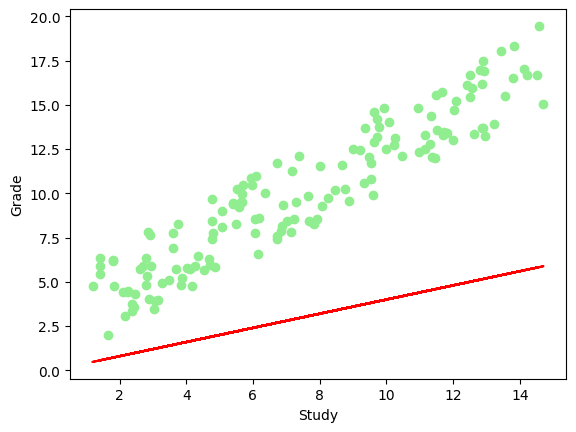

## Draw the correct blue line using your Object Oriented Linear Least Squares (LLS) method

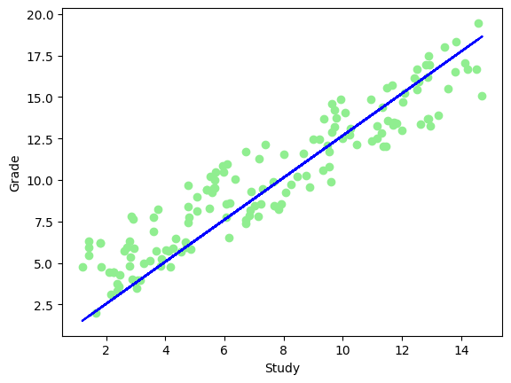

## Draw a green line using linregress from scipy library. Compare your result with scipy's result.

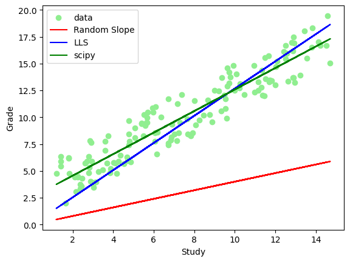

-----

# **Boston house-prices (Regression)**

###  Display the confusion matrix diagram with matplotlib

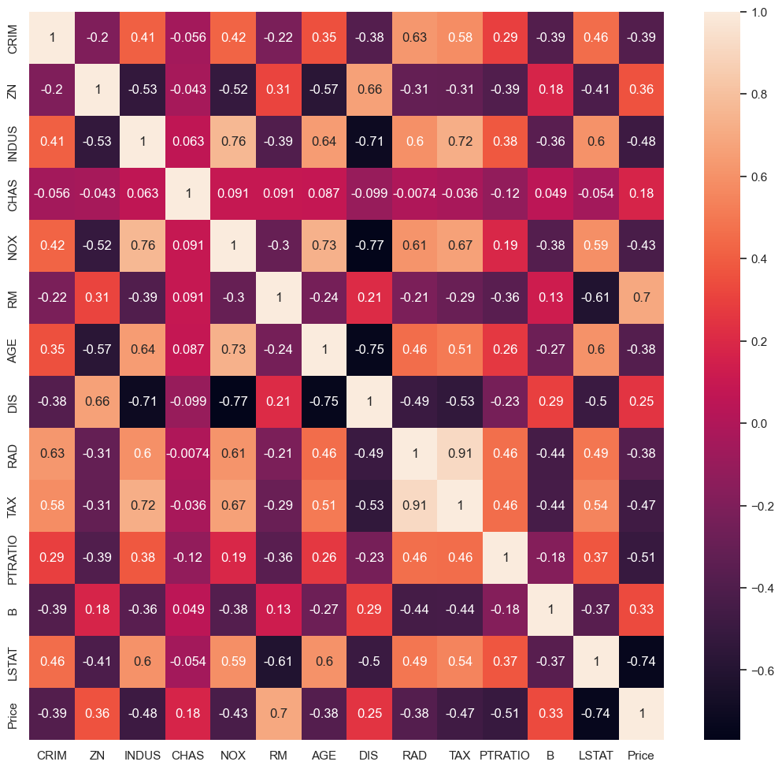

----

### Display the Pairs plot (pairwise plot) in seaborn 

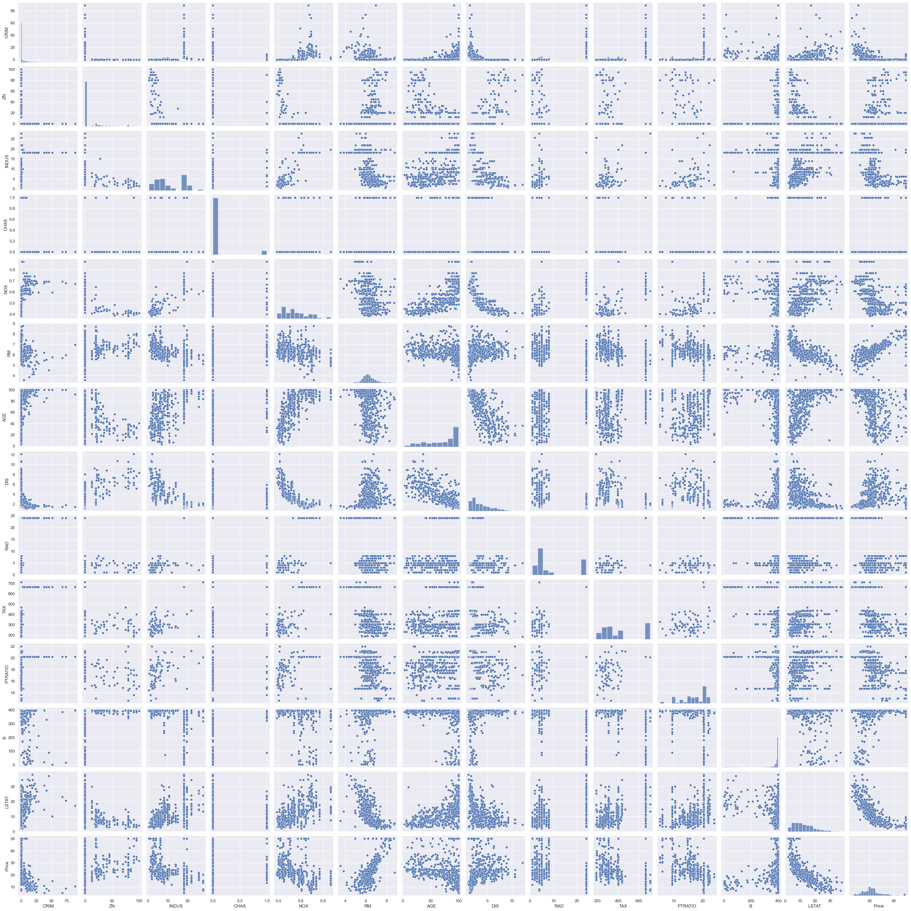

----

## Exploratory Data Analysis
Exploratory Data Analysis is a very important step before training the model. In this section, we will use some visualizations to understand the relationship of the target variable with other features.

Let’s first plot the distribution of the target variable price. We will use the distplot function from the seaborn library.

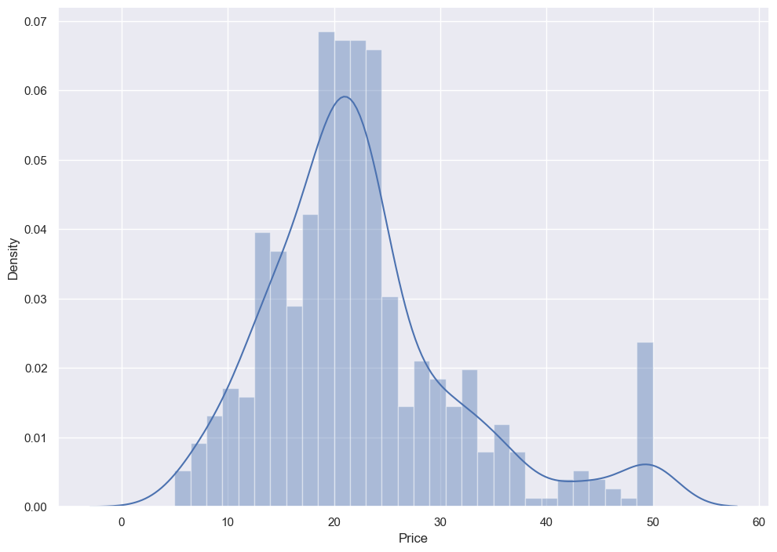

----

### This dataset has 13 features for each house. According to data correlation and your analysis, choose 2 features for X, for example:
**X = area and age**
### and choose 1 target for Y:

**Y = price**

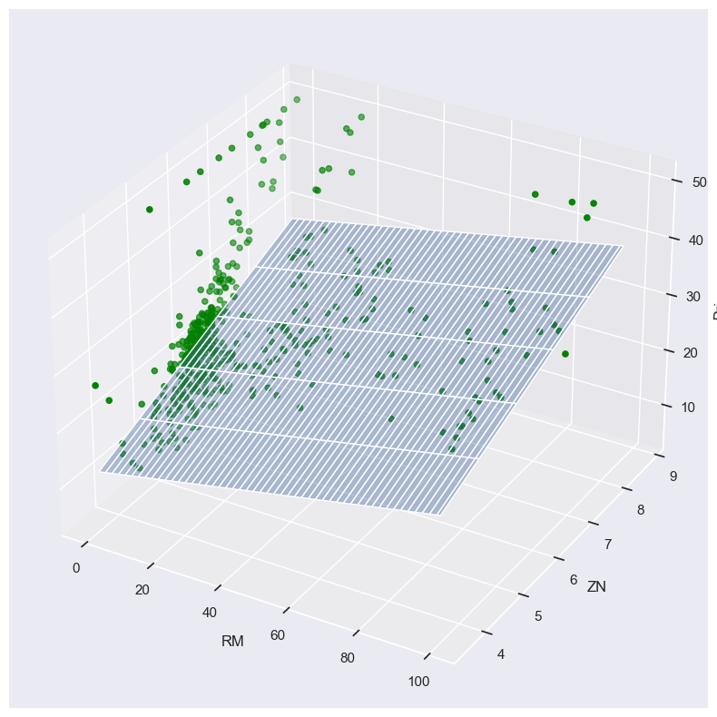
